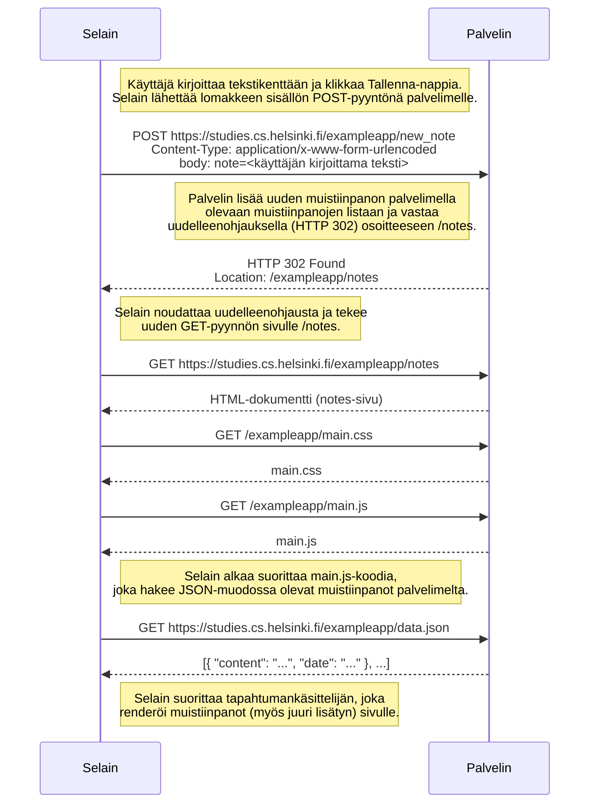

# Uuden muistiinpanon luominen sivulla `/notes`

Käyttäjä on sivulla `https://studies.cs.helsinki.fi/exampleapp/notes`, kirjoittaa tekstikenttään ja painaa **Tallenna**-nappia.

## Selitys lyhyesti

1. **Lomakkeen lähetys:** Tallenna-napin painaminen aiheuttaa lomakkeen `submit`-tapahtuman. Lomakkeen `action` on `/new_note` ja `method` on `POST`, joten selain lähettää tekstikentän sisällön palvelimelle POST-pyyntönä.
2. **Palvelimen toiminta:** Palvelin lisää uuden muistiinpanon muistissaan olevaan listaan ja vastaa uudelleenohjauksella (statuskoodi 302) osoitteeseen `/exampleapp/notes`.
3. **Uudelleenohjaus:** Selain seuraa uudelleenohjausta ja lataa `/notes`-sivun uudelleen, mukaan lukien CSS- ja JavaScript-tiedostot.
4. **Muistiinpanojen haku:** Sivun JavaScript-koodi hakee muistiinpanot erillisellä GET-pyynnöllä osoitteesta `/data.json` ja renderöi ne — myös juuri lisätyn — sivulle.
