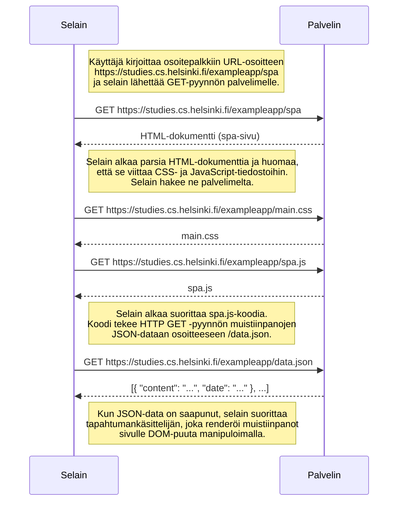

# SPA-version lataaminen sivulla `/spa`

Käyttäjä menee selaimellaan osoitteeseen `https://studies.cs.helsinki.fi/exampleapp/spa`.

## Ero tavalliseen `/notes`-versioon

SPA-versiossa palvelimelta haettava JavaScript-tiedosto on eri (`spa.js` eikä `main.js`), ja **lomakkeen lähettäminen tapahtuu jatkossa ilman sivun uudelleenlatausta** — koodi lähettää uuden muistiinpanon palvelimelle JSON-muodossa ja päivittää näkymän selaimessa itse, sen sijaan että koko sivu ladattaisiin uudelleen palvelimelta.

Itse SPA-sivun **alkulataus** näyttää kuitenkin pyyntöjen tasolla hyvin samanlaiselta kuin tavallisen `/notes`-sivun lataus: HTML, CSS, JS ja lopuksi data.json.
