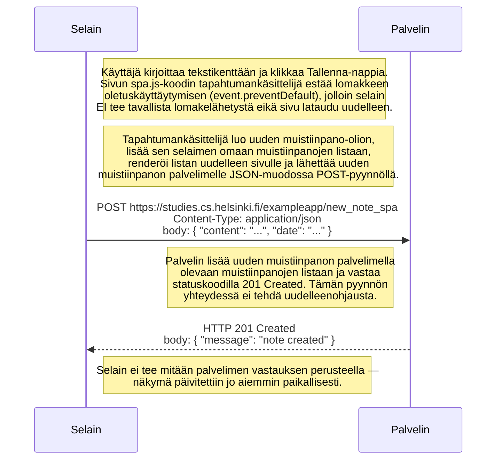

# Uuden muistiinpanon luominen SPA-versiossa

Käyttäjä on sivulla `https://studies.cs.helsinki.fi/exampleapp/spa`, kirjoittaa tekstikenttään ja painaa **Tallenna**-nappia.

## Ero tavalliseen `/notes`-versioon

| | Tavallinen `/notes` | SPA `/spa` |
|---|---|---|
| Pyynnön osoite | `POST /new_note` | `POST /new_note_spa` |
| Datan muoto | lomakedata (`application/x-www-form-urlencoded`) | JSON (`application/json`) |
| Palvelimen vastaus | 302-uudelleenohjaus | 201 Created (ei uudelleenohjausta) |
| Sivun uudelleenlataus | kyllä — koko sivu, CSS, JS ja data.json haetaan uudelleen | ei — vain yksi POST-pyyntö |
| Näkymän päivitys | palvelin lähettää uuden HTML:n | selain päivittää DOM:in itse JavaScriptillä |

SPA-versiossa siis ainoastaan **yksi HTTP-pyyntö** (POST) liikkuu verkossa muistiinpanoa luotaessa, kun taas tavallisessa versiossa selain joutuu lähetyksen jälkeen lataamaan koko sivun ja sen resurssit uudestaan.
